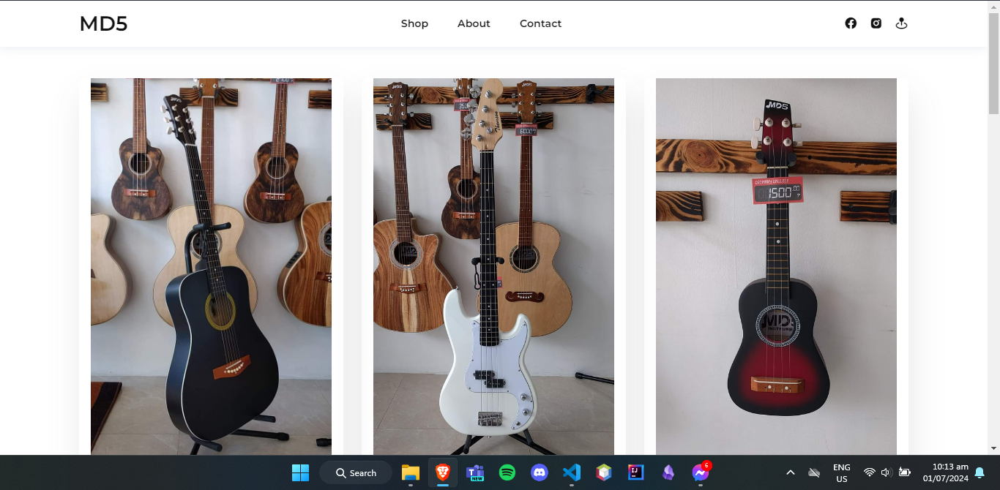
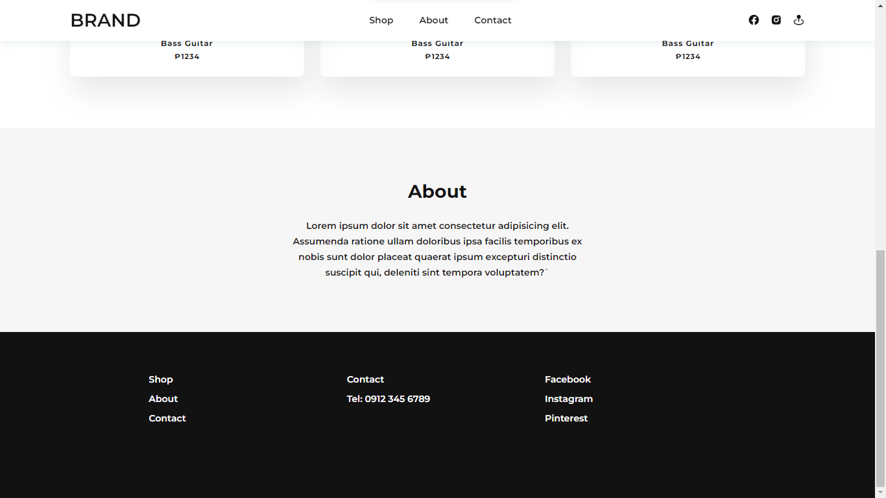

# Musical Instrument Store

A simple and responsive web page template for a fictional Musical Instrument Store. This template features a clean and modern design with sections for shopping, information about the store, and contact details. The template is built using HTML and CSS and incorporates the Boxicons library for social media icons.

## Features

- **Responsive Design:** The template is designed to be responsive, providing a seamless experience across various devices and screen sizes.

- **Navigation:** The navigation menu allows users to easily navigate to different sections of the page, including the shop, about, and contact.

- **Social Media Links:** Connect with the store through social media links, including Facebook and Instagram.

- **Contact Information:** Contact details are provided for easy communication, including a phone number and links to social media profiles.

## Screenshots

**Note:** This template is a static HTML/CSS page and doesn't include backend functionality.

## Credits

- [Boxicons](https://boxicons.com/) - A simple vector icon library.